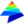

 LA-iMageS
=================================
Laser ablation and inductively coupled plasma mass spectrometry focusing on bioimaging from elemental distribution. Please, visit the [official web page ](http://sing.ei.uvigo.es/la-images) of the project for downloads and support.

Modules
-------
This project is comprised of the following modules:
* core: Contains the default implementation API.
* gui: Contains several GUI components.
* aibench: Contains a GUI application based on AIBench framework ([AIBench](http://www.aibench.org/)).

Team
----
This project is an idea and is developed by:
* Marco Aurélio Zezzi Arruda [GEPAM Group](http://gepam.iqm.unicamp.br/)
* Gustavo de Souza Pessôa [GEPAM Group](http://gepam.iqm.unicamp.br/)
* José Luis Capelo Martínez [Bioscope Group](http://www.bioscopegroup.org/)
* Florentino Fdez-Riverola [SING Group](http://sing.ei.uvigo.es)
* Miguel Reboiro-Jato [SING Group](http://sing.ei.uvigo.es)
* Hugo López-Fdez [SING Group](http://sing.ei.uvigo.es)
* Daniel Glez-Peña [SING Group](http://sing.ei.uvigo.es)
